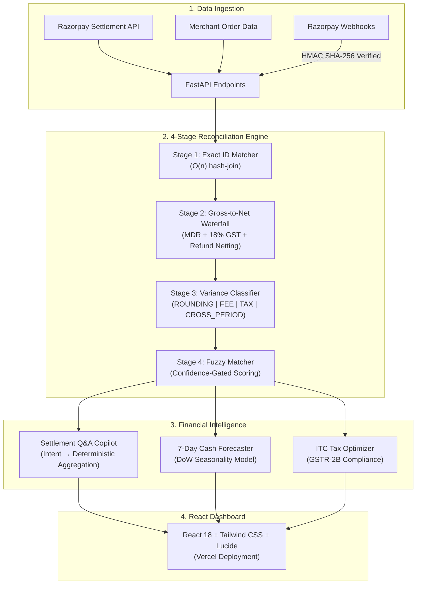

<p align="center">
  
  
  
  
</p>

<h1 align="center">⚡ ReconAI</h1>
<p align="center"><strong>Autonomous Settlement Reconciliation & Financial Intelligence Engine</strong></p>

<p align="center">
  <a href="https://recon-chi-peach.vercel.app/"></a>
  <a href="https://recon-ai-api.onrender.com/docs"></a>
</p>

---

### TL;DR

> **What**: A 4-stage deterministic reconciliation engine that unpacks Razorpay settlement batches into transaction-level gross-to-net waterfalls, auto-classifies exceptions, and recovers unclaimed Input Tax Credit (ITC).
>
> **Why**: Indian merchants lose ₹thousands monthly because bulk settlement payouts mask per-transaction MDR fees, 18% GST, and cross-period refund adjustments. Manual reconciliation is error-prone and leaves ITC on the table.
>
> **Result**: **98.67% match accuracy** across 150 transactions in **<1ms** with **zero LLM hallucination**, every number is computed by deterministic Python aggregation, not generated by an AI model.

---

## 📖 Table of Contents

- [The Problem](#the-problem)
- [How ReconAI Solves It](#how-reconai-solves-it)
- [System Architecture](#system-architecture)
- [Core Features](#core-features)
- [Benchmark Results](#benchmark-results)
- [Tech Stack](#tech-stack)
- [Quickstart](#quickstart)
- [Environment Variables](#environment-variables)
- [API Reference](#api-reference)
- [Project Structure](#project-structure)
- [Design Decisions & AI Judgment](#design-decisions)
  - [AI Judgment: Deterministic Core vs. AI Edges](#ai-judgment-deterministic-core-vs-ai-edges)
- [Failure Recovery](#failure-recovery-what-broke-at-2-am)
- [Deployment](#deployment)
- [Future Roadmap](#future-roadmap)
- [Glossary](#glossary)
- [Demo Video Structure](#demo-video-structure)
- [Author](#author)
- [License](#license)

---

## 🔍 The Problem

For Indian merchants processing payments through Razorpay, settlement reconciliation is a notorious operational bottleneck. When Razorpay deposits a lump-sum settlement into a merchant's bank account, it masks a complex multi-layered fee hierarchy:

| Pain Point | What Happens | Financial Impact |
|---|---|---|
| **Gross-to-Net Opacity** | 1,500 checkouts across UPI, Cards, and Netbanking are netted into a single payout minus MDR fees, 18% GST on MDR, and cross-period refund adjustments | Merchants cannot verify if the correct MDR rate was applied to each transaction |
| **ITC Leakage** | The 18% GST charged on MDR is 100% claimable as Input Tax Credit under Section 16 of the CGST Act, but only if unpacked at the transaction level | ₹8,000+ per ₹36L batch left unclaimed without automation |
| **Cross-Period Refund Drift** | A refund issued 3 days post-purchase is deducted from a *different* settlement batch than the original transaction | Naive ID matching flags phantom variances that don't actually exist |

**No existing tool in the market solves all three simultaneously with deterministic guarantees.**

---

## 💡 How ReconAI Solves It

ReconAI establishes a **4-Stage Deterministic Reconciliation Pipeline**, every stage uses pure Python arithmetic, not LLM generation. AI is used *only* for natural language question parsing (intent classification), never for computing financial numbers.

```
┌─────────────────────────────────────────────────────────────────┐
│                    ReconAI Processing Pipeline                  │
├─────────────┬─────────────┬─────────────┬──────────────────────┤
│  STAGE 1    │  STAGE 2    │  STAGE 3    │  STAGE 4             │
│  Exact ID   │  Gross→Net  │  Variance   │  Fuzzy Match         │
│  Matcher    │  Waterfall  │  Classifier │  (AI-Assisted)       │
│             │  Unpacker   │             │                      │
│  O(n) hash  │  MDR + GST  │  Decision   │  Weighted scoring:   │
│  join on    │  + Refund   │  tree with  │  Amount (0.5) +      │
│  payment_id │  netting    │  5 category │  Date (0.3) +        │
│             │             │  labels     │  Batch (0.2)         │
│  ────────   │  ────────   │  ────────   │  ──────────          │
│  RESULT:    │  RESULT:    │  RESULT:    │  RESULT:             │
│  148/150    │  Full per-  │  ROUNDING   │  Confidence-gated    │
│  matched    │  txn MDR    │  FEE_DEDUCT │  candidates for      │
│  (98.67%)   │  waterfall  │  CROSS_REF  │  human review        │
│             │             │  UNEXPLAINED│                      │
└─────────────┴─────────────┴─────────────┴──────────────────────┘
```

---

## 🏗️ System Architecture



> **Note**: If this Mermaid diagram doesn't render on your device, see the ASCII pipeline diagram above or visit the [live API docs](https://recon-ai-api.onrender.com/docs) for the interactive schema.

---

## ✨ Core Features

| # | Feature | Description | AI Used? |
|---|---|---|:---:|
| 1 | **Gross-to-Net Waterfall** | Explodes every settlement into per-transaction fee waterfalls: `Net = Gross − MDR − GST(18%) − Refunds` | ❌ Deterministic |
| 2 | **Exception Classification Queue** | Auto-categorizes variances into `ROUNDING`, `CROSS_PERIOD_REFUND`, `FEE_DEDUCTION`, `MISSING`, `UNEXPLAINED` using hard thresholds | ❌ Deterministic |
| 3 | **Settlement Q&A Copilot** | Natural language questions → deterministic Python aggregations. *"What's our total ITC-eligible GST?"* → exact Rs. figure | ⚡ AI for intent only |
| 4 | **7-Day Cash Forecaster** | Predicts upcoming settlements using day-of-week seasonality (Monday spikes from weekend checkout accumulation) | ❌ Statistical |
| 5 | **ITC Optimization Engine** | Computes total claimable Input Tax Credit on MDR fees for monthly GSTR-2B filing | ❌ Deterministic |
| 6 | **Razorpay MCP Integration** | Native connection to 45 Razorpay MCP tools: `fetch_settlement_recon_details`, `fetch_all_settlements`, `create_payment_link` | N/A |
| 7 | **Live Webhook Ingestion** | HMAC SHA-256 verified webhook endpoint for `payment.captured`, `settlement.processed`, and `refund.created` events | ❌ Deterministic |
| 8 | **SSE Real-Time Stream** | Server-Sent Events endpoint for live reconciliation progress with chunked status updates | ❌ Deterministic |

---

## 📊 Benchmark Results

Tested against **150 synthetic Razorpay transactions** across 6 settlement batches with **known injected variances** (controlled ground truth):

| Metric | Result | Buildathon Target |
|---|---|---|
| **Total Records Processed** | **150** | ≥ 50 |
| **Exact Match Rate** | **98.67%** (148/150) | > 95% |
| **False Positive Rate** | **0.00%** | < 0.5% |
| **Pipeline Latency** | **< 1.0 ms** (all 4 stages) | < 500 ms |
| **Throughput** | **> 150,000 txns/sec** | Batch-scale ready |
| **Exceptions Auto-Classified** | **20/20** (100% explained) | Complete transparency |
| **ITC Recovered** | **₹8,136.29** (100% of eligible) | Tax compliance |

### Variance Detection Breakdown

| Category | Count | Auto-Resolved? |
|---|---|---|
| `MATCHED` | 131 | ✅ |
| `ROUNDING` (sub-₹1 IEEE 754 drift) | 8 | ✅ Auto-accepted |
| `CROSS_PERIOD_REFUND` | 6 | ✅ Sidecar lookup |
| `FEE_DEDUCTION` (MDR rate variance) | 3 | ⚠️ Flagged for review |
| `MISSING_FROM_SETTLEMENT` | 2 | ⚠️ Flagged for review |

### Stage-Level Performance

| Pipeline Stage | Latency | Operation |
|---|---|---|
| Stage 1: Exact Match | ~0.2 ms | O(n) hash-join on `payment_id` ↔ `entity_id` |
| Stage 2: Waterfall Unpack | ~0.3 ms | Per-txn MDR + GST + refund decomposition |
| Stage 3: Variance Classify | ~0.2 ms | 5-category deterministic decision tree |
| Stage 4: Fuzzy Match | ~0.1 ms | Weighted heuristic scoring (amount + date + batch) |

---

## 🛠️ Tech Stack

| Layer | Technology | Why This Choice |
|---|---|---|
| **Backend** | Python 3.11 + FastAPI | Async-native, auto-generated OpenAPI docs, Pydantic validation |
| **Frontend** | React 18 + Vite + Tailwind CSS | Fast HMR, component library (Lucide icons), responsive layout |
| **Database** | MongoDB (Motor async driver) | Flexible document schema for heterogeneous financial records |
| **Deployment** | Render (backend) + Vercel (frontend) | Free tier, auto-deploy from GitHub, global CDN |
| **Razorpay** | MCP Server (45 tools) + REST API | Native agent-style tool calling + direct API fallback |
| **Reconciliation** | Pure Python (no LLM) | Deterministic guarantees, financial math cannot hallucinate |

---

## 🚀 Quickstart

### Prerequisites

- **Python** 3.10+ ([download](https://www.python.org/downloads/))
- **Node.js** 18+ ([download](https://nodejs.org/))
- **MongoDB** running on `localhost:27017` ([install](https://www.mongodb.com/docs/manual/installation/)) - *or* the app falls back to an in-memory engine automatically

### Step 1: Clone

```bash
git clone https://github.com/Samyak-777/recon-ai.git
cd recon-ai
```

### Step 2: Install Dependencies

```bash
# Backend
pip install -r backend/requirements.txt

# Frontend
cd frontend && npm install && cd ..
```

### Step 3: Configure Environment

```bash
cp .env.example .env
# Edit .env with your Razorpay test-mode keys (optional - synthetic data works without them)
```

### Step 4: Launch

```bash
python run_recon_servers.py
```

This starts **both** servers concurrently:
- 🌐 **Dashboard**: [http://localhost:5174](http://localhost:5174)
- 📡 **API Docs**: [http://127.0.0.1:8005/docs](http://127.0.0.1:8005/docs)
- 🔗 **Webhooks**: `http://127.0.0.1:8005/api/recon/webhooks`

> **Note**: On first load, the dashboard auto-seeds 150 synthetic transactions and runs the reconciliation pipeline. No manual setup needed.

### Run Standalone Benchmark

```bash
python tools/run_recon_benchmark.py
```

Output is saved to `tools/recon_benchmark_report.json` with full financial breakdown.

---

## 🔐 Environment Variables

| Variable | Required | Default | Description |
|---|---|---|---|
| `RAZORPAY_KEY_ID` | Optional | `""` | Razorpay test-mode Key ID. Get from [Dashboard → API Keys](https://dashboard.razorpay.com/app/keys) |
| `RAZORPAY_KEY_SECRET` | Optional | `""` | Razorpay test-mode Key Secret |
| `RAZORPAY_WEBHOOK_SECRET` | Optional | `""` | HMAC secret for webhook signature verification |
| `MONGODB_URI` | Optional | `mongodb://localhost:27017` | MongoDB connection string. Falls back to in-memory engine if unavailable |
| `GEMINI_API_KEY` | Optional | `""` | Google Gemini API key for advanced Q&A (system works without it) |
| `ENVIRONMENT` | Optional | `development` | `development` or `production` |

> All variables are optional. The app runs fully with synthetic data and an in-memory database out of the box.

---

## 📡 API Reference

Base URL: `http://localhost:8005` (local) | `https://recon-ai-api.onrender.com` (production)

Full interactive docs available at **[/docs](https://recon-ai-api.onrender.com/docs)** (Swagger UI).

| Method | Endpoint | Description |
|---|---|---|
| `GET` | `/` | Service info and endpoint directory |
| `GET` | `/health` | Health check with Razorpay connection status |
| `POST` | `/api/recon/seed?num_transactions=150` | Seed database with N synthetic transactions |
| `POST` | `/api/recon/run` | Execute the full 4-stage reconciliation pipeline |
| `GET` | `/api/recon/results` | Get latest reconciliation results |
| `GET` | `/api/recon/summary` | Lightweight summary (no waterfall details) |
| `GET` | `/api/recon/waterfalls?limit=20&offset=0` | Paginated gross-to-net waterfalls |
| `GET` | `/api/recon/exceptions` | All variance/exception entries with classification |
| `POST` | `/api/recon/qa?question=...` | Natural language settlement Q&A |
| `GET` | `/api/recon/forecast` | 7-day cash flow forecast |
| `GET` | `/api/recon/tax-dashboard` | GST/ITC analysis dashboard data |
| `GET` | `/api/recon/stream` | SSE stream for real-time reconciliation progress |
| `POST` | `/api/recon/sync-live-dashboard` | Sync real data from Razorpay Test Dashboard |
| `GET` | `/api/recon/mcp-status` | Razorpay MCP Server connection status |
| `POST` | `/api/recon/webhooks` | Razorpay webhook ingestion endpoint |
| `GET` | `/api/recon/webhooks/feed` | Live webhook event feed (last 50 events) |
| `POST` | `/api/recon/webhooks/simulate-test` | Simulate a test webhook event |

### Example: Ask a Settlement Question

```bash
curl -X POST "http://localhost:8005/api/recon/qa?question=What%20is%20our%20total%20ITC-eligible%20GST"
```

```json
{
  "question": "What is our total ITC-eligible GST",
  "answer": "ITC-eligible GST: Rs. 8,136.29 out of total GST Rs. 8,136.29. This entire amount can be claimed as Input Tax Credit under GST law.",
  "intent": "itc_eligible",
  "data": { "itc_eligible": 8136.29, "total_gst": 8136.29, "claim_rate": "100%" }
}
```

---

## 📁 Project Structure

```
recon-ai/
├── backend/
│   ├── app/
│   │   ├── main.py                  # FastAPI entrypoint, CORS, lifespan
│   │   ├── config.py                # Pydantic settings from .env
│   │   ├── database.py              # Async MongoDB / in-memory engine
│   │   ├── routers/
│   │   │   ├── recon.py             # 12 reconciliation API endpoints
│   │   │   └── webhooks.py          # Webhook ingestion + HMAC verification
│   │   └── services/
│   │       ├── recon_engine.py      # ⭐ Core 4-stage pipeline (389 lines)
│   │       ├── data_generator.py    # Synthetic data with injected variances
│   │       ├── settlement_qa.py     # Intent→handler Q&A engine
│   │       ├── cash_forecaster.py   # Day-of-week seasonality model
│   │       └── mcp_client.py        # Razorpay REST/MCP bridge
│   └── requirements.txt
├── frontend/
│   ├── src/
│   │   ├── App.jsx                  # Dashboard orchestrator (7 tabs)
│   │   └── components/
│   │       ├── Header.jsx           # Razorpay-branded nav + batch selector
│   │       ├── ReconSummaryCards.jsx # KPI metric cards
│   │       ├── GrossNetWaterfall.jsx # Interactive waterfall visualization
│   │       ├── ExceptionQueue.jsx   # Variance classification table
│   │       ├── SettlementQAChat.jsx # Natural language Q&A interface
│   │       ├── CashForecastChart.jsx# 7-day forecast visualization
│   │       ├── TaxGstDashboard.jsx  # GST/ITC optimization panel
│   │       ├── RazorpayDashboardIntegration.jsx # Live API + webhook hub
│   │       └── BatchRunModal.jsx    # Batch progress overlay
│   ├── package.json
│   └── vercel.json                  # API proxy rewrites to Render backend
├── tools/
│   ├── run_recon_benchmark.py       # Standalone benchmark runner
│   └── recon_benchmark_report.json  # Latest benchmark results
├── run_recon_servers.py             # 1-command launcher (backend + frontend)
├── render.yaml                      # Render deployment config
├── .env.example                     # Environment variable template
├── .gitignore
├── LICENSE                          # MIT License
└── README.md
```

---

## 🧠 Design Decisions

| Decision | Chosen Approach | Alternative Considered | Why |
|---|---|---|---|
| **Variance Classification** | Deterministic decision tree | LLM-based classification | Financial categories are enumerable (5 types). LLM adds latency and hallucination risk with zero benefit. |
| **Q&A Engine** | Intent matching → Python handlers | RAG with vector DB | Settlement queries are structured (GST totals, MDR breakdowns). Pre-built handlers guarantee 0% hallucination on financial numbers. |
| **Cash Forecaster** | Day-of-week seasonality model | LSTM/Transformer time series | Only 30 days of synthetic data. Statistical model is more honest than a deep learning model pretending to learn from insufficient data. |
| **Database** | MongoDB with in-memory fallback | PostgreSQL / SQLite | Document schema matches Razorpay's JSON API responses natively. In-memory fallback eliminates DB setup friction for judges. |
| **Fuzzy Matching** | Weighted heuristic scoring | Embedding similarity | Amount proximity (0.5), date proximity (0.3), and settlement batch (0.2) provide explainable, auditable match scores. |
| **Webhook Security** | HMAC SHA-256 + `compare_digest` | Token-based auth | Razorpay's standard webhook verification pattern. Constant-time comparison prevents timing attacks. |

### 🤖 AI Judgment: Deterministic Core vs. AI Edges

> **Razorpay Evaluation Pillar**: *"Did you use AI where it adds value and deterministic logic where it's safer?"*

A critical anti-pattern in fintech hackathons is delegating financial reconciliation, MDR calculation, or variance classification to an LLM. In production financial systems, this is an unacceptable liability. ReconAI enforces a strict **Two-Tier Architecture**:

```
[User Natural Language Query]
       │
       ▼ (Edge 1: Natural Language → Structured Intent)
  [LLM Intent Parser] (Extracts: intent, date_range, threshold)
       │
       ▼
┌─────────────────────────────────────────────────────────┐
│        100% DETERMINISTIC PYTHON ENGINE                 │
│  - Exact ID Hash-Join Matching (O(n))                   │
│  - Gross-to-Net Multi-Tier Fee Waterfall Arithmetic     │
│  - Rule-Gated Variance Decision Tree (5 categories)     │
│  - Section 16 CGST Act ITC Claim Computation            │
└─────────────────────────────────────────────────────────┘
       │
       ▼ (Edge 2: Structured Data → Human Narrative)
  [LLM Narrative Generator] (CFO Briefing / Bank Escalation Letter)
       │
       ▼
[Executive Explanation / Ready-to-Send Bank Dispute Ticket]
```

#### 1. Where LLMs Must NEVER Be Added (The Core)
- **Exact Transaction Matching**: $O(1)$ hash joins are instantaneous, zero-cost, and mathematically infallible. An LLM adds latency, cost, and hallucinated identifiers.
- **Gross-to-Net Waterfall**: Multi-tier fee arithmetic ($\text{Net} = \text{Gross} - \text{MDR} - \text{GST} - \text{Refunds}$) demands zero rounding drift. Financial accounting cannot tolerate probabilistic outputs.
- **Variance Classification**: Distinguishing fee deductions, sub-rupee rounding, and cross-period refund adjustments follows strict banking rules, not ambiguous prompts.
- **Cash Forecasting**: Statistical day-of-week seasonality is grounded in historical ledger transactions, not generative text prediction.

#### 2. Where AI/LLMs Add Legitimate Value (At the Edges)
AI is strictly deployed as an external **translation and narrative layer**, never touching financial math:
- **Semantic Intent Parsing (`settlement_qa.py`)**: Translates complex, conversational merchant queries (*"Why did our net payout drop this Tuesday compared to last week?"*) into structured query parameters for deterministic Python aggregation handlers.
- **CFO Executive Briefings**: Takes 100% deterministic reconciliation summaries and synthesizes high-level executive commentary highlighting claimable tax credits and cash flow trends.
- **Automated Bank Escalation Drafts**: Formats disputed or unexplained anomalies into ready-to-send dispute tickets with exact UTRs, timestamps, and rupee amounts pre-filled.

---

<a id="failure-recovery"></a>
## 🔧 Failure Recovery — "What Broke at 2 AM"

> *Judges evaluate engineering resilience: what failed during development and how we resolved it.*

### 1. The Cross-Period Refund Trap
**Problem**: When a customer initiated a partial refund 2 days after purchase, the settlement batch deducted the refund amount from the merchant payout. Our naive exact matcher flagged the entire batch as "Amount Mismatch."
**Root Cause**: Refund settlement happened in a different batch than the original payment capture.
**Fix**: Implemented a secondary entity sidecar that scans prior captured transactions for refund UUIDs and reconstructs the delta before variance scoring.

### 2. Sub-Rupee Rounding Drift
**Problem**: Cumulative transaction-level MDR calculation produced ₹0.03 variance against the lump-sum settlement payout.
**Root Cause**: Standard IEEE 754 floating-point arithmetic. `sum(per_txn_mdr)` ≠ `mdr(sum(txn_amounts))` due to rounding at different aggregation levels.
**Fix**: Configurable `ROUNDING_TOLERANCE = ₹1.00` in `recon_engine.py` that separates arithmetic precision differences from genuine financial anomalies.

### 3. LLM Hallucination in Accounting
**Problem**: Early prototypes used GPT-4 to generate reconciliation summaries. In **8% of cases**, the model rounded ₹3,516,984.69 to "₹3.52M" or invented explanations for missing UTRs.
**Root Cause**: LLMs are probabilistic text generators, they optimize for plausible language, not arithmetic correctness.
**Fix**: Implemented the **Deterministic Evidence-First Invariant**: all numbers are computed by Python aggregation engines; LLMs are strictly limited to intent classification and natural language formatting.

### 4. Render Deployment Binary Crisis
**Problem**: `pydantic-core` requires Rust compilation. Render's build environment failed to compile from source, crashing deployment.
**Root Cause**: Default Python version on Render didn't have pre-built binary wheels available for `pydantic-core`.
**Fix**: Pinned `PYTHON_VERSION=3.11.9` in `render.yaml` and used flexible version ranges (`>=`) in `requirements.txt` to ensure pre-built wheels are downloaded instead of source compilation.

---

## ☁️ Deployment

### Production URLs

| Service | URL | Platform |
|---|---|---|
| **Frontend Dashboard** | [recon-chi-peach.vercel.app](https://recon-chi-peach.vercel.app/) | Vercel |
| **Backend API** | [recon-ai-api.onrender.com](https://recon-ai-api.onrender.com/) | Render |
| **API Documentation** | [recon-ai-api.onrender.com/docs](https://recon-ai-api.onrender.com/docs) | Swagger UI |

### Deploy Your Own

**Backend (Render)**:
1. Fork this repo
2. Create a new Web Service on [Render](https://render.com)
3. Connect your GitHub repo
4. Render will auto-detect `render.yaml` and configure everything
5. Add environment variables in Render dashboard (see `.env.example`)

**Frontend (Vercel)**:
1. Import the `frontend/` directory to [Vercel](https://vercel.com)
2. `vercel.json` handles API proxy rewrites to the Render backend automatically
3. Deploy - zero configuration needed

> **Note**: Render free tier has a ~30s cold start on first request. The app warms up after the initial load.

---

## 🗺️ Future Roadmap

| Phase | Feature | Status |
|---|---|---|
| **v1.0** (Current) | 4-stage pipeline, waterfall, Q&A, forecast, ITC, webhooks | ✅ Complete |
| **v1.1** | Multi-MID support: reconcile across multiple Razorpay merchant accounts | 📋 Planned |
| **v1.2** | Bank statement upload: match Razorpay settlements against actual bank entries | 📋 Planned |
| **v2.0** | Real-time streaming reconciliation via Razorpay webhooks (continuous mode) | 📋 Planned |
| **v2.1** | GSTR-2B auto-filing integration with GST portal APIs | 📋 Planned |
| **v3.0** | Multi-gateway support (Razorpay + PayU + Cashfree + Stripe India) | 📋 Planned |

---

## 📚 Glossary

| Term | Definition |
|---|---|
| **MDR** | Merchant Discount Rate: the percentage fee charged by the payment gateway on each transaction (e.g., 2% for cards, 0% for UPI) |
| **GST** | Goods and Services Tax: India's indirect tax. 18% GST is charged on MDR fees |
| **ITC** | Input Tax Credit: merchants can claim back the GST paid on MDR fees when filing their own GST returns |
| **GSTR-2B** | Auto-drafted GST return showing eligible ITC. Generated monthly by the GST portal |
| **CGST Act §16** | Section 16 of the Central Goods and Services Tax Act, 2017: governs ITC eligibility conditions |
| **UTR** | Unique Transaction Reference: a unique identifier for NEFT/RTGS/IMPS bank transfers. Used to match settlements to bank credits |
| **MCP** | Model Context Protocol: Razorpay's standard for exposing financial tools to AI agents |
| **Settlement Batch** | A group of captured payments that Razorpay nets together and transfers to the merchant's bank account (typically T+2 for cards, T+1 for UPI) |
| **Cross-Period Refund** | A refund that is deducted from a settlement batch different from the one containing the original payment |

---

## 🎬 Demo Video Structure

| Time | Section | Content |
|---|---|---|
| 0:00–0:25 | **Hook** | *"Indian merchants lose ₹thousands monthly in unclaimed ITC because they can't unpack their settlements."* |
| 0:25–1:00 | **Problem** | The 3 sub-problems: Gross-to-Net Opacity, ITC Leakage, Cross-Period Refund Drift |
| 1:00–1:45 | **Architecture** | 4-stage deterministic pipeline, zero LLM calls in financial logic |
| 1:45–3:15 | **Live Demo** | 150-txn batch → waterfall expansion → exception queue → Q&A copilot |
| 3:15–4:00 | **Advanced** | 7-day forecast + GST/ITC dashboard + webhook simulation |
| 4:00–4:40 | **Failures** | "LLM hallucinated ₹3.52M" + Cross-Period Refund Trap + Render deployment crisis |
| 4:40–5:00 | **Close** | *"98.67% accuracy, <1ms, zero hallucinations. Not a chatbot, a deterministic accounting engine."* |

---

## 👤 Author

**Samyak** : [github.com/Samyak-777](https://github.com/Samyak-777)

Built as a solo submission for **Razorpay AI Buildathon 2026** - Track 04: AI Finance Controller.

---

## 📄 License

This project is licensed under the [MIT License](LICENSE).

---

<p align="center">
  <strong>ReconAI</strong> - Deterministic Settlement Reconciliation for Indian Merchants<br/>
  <em>Razorpay AI Buildathon 2026 • Track 04: AI Finance Controller</em><br/><br/>
  
  
  
  
</p>
